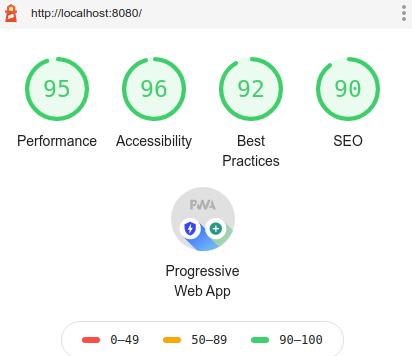
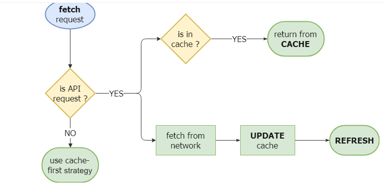

<h1>Progressive Web App (PWA)</h1>

[](https://github.com/Mishra121/PWA-project) [](https://github.com/Mishra121)

**A simple Progressive Web App Example<sup>PWA</sup>. 

> A **progressive web app** takes advantage of the latest technologies to combine the best of web and mobile apps. [What are Progressive Web Apps?](https://web.dev/what-are-pwas/).

### Getting started

To install [this](https://github.com/Mishra121/PWA-project) project, you need to clone or [download](https://github.com/Mishra121/PWA-project/archive/main.zip).

```bash
git clone https://github.com/Mishra121/PWA-project.git
cd PWA-project
```

### Running locally :desktop_computer:

- You can use http-server module `npm install -g http-server`

- Run `http-server .`

- Browse http://localhost:8080


### Light House Report



### Used Cache,Update,Refresh strategy 



### Useful Resources

- [Google Developers - Progressive Web Apps](https://developers.google.com/web/progressive-web-apps/)
- [PWA workshop](https://pwa-workshop.js.org/)
- [Native application VS Progressive Web App: which one should you choose?](https://medium.com/inside-smartapps/native-application-vs-progressive-web-app-which-one-should-you-choose-5eeaaf6ee92d)

### Author

**[Vibhu Mishra](https://www.linkedin.com/in/vibhu-mishra-654a0914a/)**

